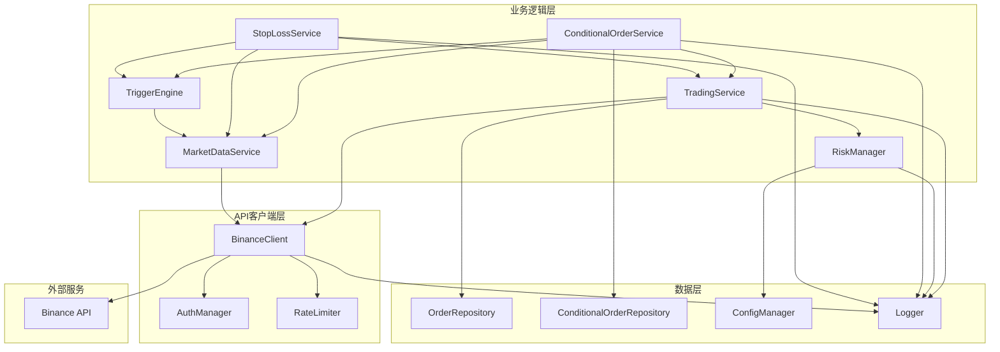

# 设计文档

## 概述

币安自动交易系统是一个使用Go语言开发的模块化交易应用程序。系统采用分层架构，将API通信、业务逻辑和数据管理清晰分离。核心设计原则包括安全性、可靠性和可扩展性。

系统将使用币安官方REST API进行交易操作，并实现完整的错误处理、重试机制和速率限制管理。所有敏感信息通过环境变量管理，API请求使用HMAC-SHA256签名确保安全性。

## 架构

系统采用三层架构：

### 表示层（API客户端层）
- **BinanceClient**: 封装所有币安API调用
- 负责HTTP请求构建、签名和响应解析
- 实现速率限制和重试逻辑

### 业务逻辑层
- **TradingService**: 实现交易策略和订单管理逻辑
- **RiskManager**: 执行风险控制规则
- **MarketDataService**: 处理市场数据获取和缓存

### 数据层
- **OrderRepository**: 管理订单数据持久化
- **ConfigManager**: 管理系统配置
- **Logger**: 统一日志记录

### 架构图



## 组件和接口

### 1. BinanceClient

币安API客户端，负责所有与币安交易所的通信。

```go
type BinanceClient interface {
    // 账户信息
    GetAccountInfo() (*AccountInfo, error)
    GetBalance(asset string) (*Balance, error)
    
    // 市场数据
    GetPrice(symbol string) (*Price, error)
    GetKlines(symbol string, interval string, limit int) ([]*Kline, error)
    
    // 订单操作
    CreateOrder(order *OrderRequest) (*OrderResponse, error)
    CancelOrder(symbol string, orderID int64) (*CancelResponse, error)
    GetOrder(symbol string, orderID int64) (*Order, error)
    GetOpenOrders(symbol string) ([]*Order, error)
    GetHistoricalOrders(symbol string, startTime, endTime int64) ([]*Order, error)
}
```

### 2. TradingService

交易服务，实现核心交易逻辑。

```go
type TradingService interface {
    // 订单创建
    PlaceMarketBuyOrder(symbol string, quantity float64) (*Order, error)
    PlaceLimitSellOrder(symbol string, price, quantity float64) (*Order, error)
    
    // 订单管理
    CancelOrder(orderID int64) error
    GetOrderStatus(orderID int64) (*OrderStatus, error)
    GetActiveOrders() ([]*Order, error)
}
```

### 3. RiskManager

风险管理器，执行风险控制规则。

```go
type RiskManager interface {
    // 风险检查
    ValidateOrder(order *OrderRequest) error
    CheckDailyLimit() error
    CheckMinimumBalance(asset string) error
    
    // 限制管理
    UpdateLimits(limits *RiskLimits) error
    GetCurrentLimits() *RiskLimits
}
```

### 4. MarketDataService

市场数据服务，提供市场信息。

```go
type MarketDataService interface {
    GetCurrentPrice(symbol string) (float64, error)
    GetHistoricalData(symbol string, interval string, limit int) ([]*Kline, error)
    SubscribeToPrice(symbol string, callback func(float64)) error
    GetVolume(symbol string, timeWindow time.Duration) (float64, error)
}
```

### 5. ConditionalOrderService

条件订单服务，管理条件触发订单。

```go
type ConditionalOrderService interface {
    // 创建条件订单
    CreateConditionalOrder(order *ConditionalOrderRequest) (*ConditionalOrder, error)
    
    // 管理条件订单
    CancelConditionalOrder(orderID string) error
    UpdateConditionalOrder(orderID string, updates *ConditionalOrderUpdate) error
    GetConditionalOrder(orderID string) (*ConditionalOrder, error)
    GetActiveConditionalOrders() ([]*ConditionalOrder, error)
    GetConditionalOrderHistory(startTime, endTime int64) ([]*ConditionalOrder, error)
    
    // 监控和触发
    StartMonitoring() error
    StopMonitoring() error
}
```

### 6. StopLossService

止损止盈服务，管理风险控制订单。

```go
type StopLossService interface {
    // 设置止损止盈
    SetStopLoss(symbol string, position float64, stopPrice float64) (*StopOrder, error)
    SetTakeProfit(symbol string, position float64, targetPrice float64) (*StopOrder, error)
    SetStopLossTakeProfit(symbol string, position float64, stopPrice, targetPrice float64) (*StopOrderPair, error)
    SetTrailingStop(symbol string, position float64, trailPercent float64) (*TrailingStopOrder, error)
    
    // 管理止损止盈订单
    CancelStopOrder(orderID string) error
    GetActiveStopOrders(symbol string) ([]*StopOrder, error)
    UpdateTrailingStop(orderID string, newTrailPercent float64) error
}
```

### 7. TriggerEngine

触发引擎，评估和执行触发条件。

```go
type TriggerEngine interface {
    // 评估触发条件
    EvaluateCondition(condition *TriggerCondition, marketData *MarketData) (bool, error)
    EvaluateCompositeCondition(conditions []*TriggerCondition, operator LogicOperator, marketData *MarketData) (bool, error)
    
    // 注册和管理监控
    RegisterCondition(orderID string, condition *TriggerCondition) error
    UnregisterCondition(orderID string) error
}
```

## 数据模型

### OrderRequest
```go
type OrderRequest struct {
    Symbol      string      // 交易对，如 "BTCUSDT"
    Side        OrderSide   // BUY 或 SELL
    Type        OrderType   // MARKET 或 LIMIT
    Quantity    float64     // 交易数量
    Price       float64     // 价格（限价单）
    TimeInForce string      // GTC, IOC, FOK
}
```

### Order
```go
type Order struct {
    OrderID       int64
    Symbol        string
    Side          OrderSide
    Type          OrderType
    Status        OrderStatus
    Price         float64
    OrigQty       float64
    ExecutedQty   float64
    CummulativeQuoteQty float64
    Time          int64
    UpdateTime    int64
}
```

### Balance
```go
type Balance struct {
    Asset  string
    Free   float64
    Locked float64
}
```

### Kline
```go
type Kline struct {
    OpenTime  int64
    Open      float64
    High      float64
    Low       float64
    Close     float64
    Volume    float64
    CloseTime int64
}
```

### RiskLimits
```go
type RiskLimits struct {
    MaxOrderAmount    float64  // 单笔最大金额
    MaxDailyOrders    int      // 每日最大订单数
    MinBalanceReserve float64  // 最小保留余额
    MaxAPICallsPerMin int      // 每分钟最大API调用数
}
```

### ConditionalOrderRequest
```go
type ConditionalOrderRequest struct {
    Symbol          string              // 交易对
    Side            OrderSide           // BUY 或 SELL
    Type            OrderType           // MARKET 或 LIMIT
    Quantity        float64             // 交易数量
    Price           float64             // 价格（限价单）
    TriggerCondition *TriggerCondition  // 触发条件
    TimeWindow      *TimeWindow         // 时间窗口限制（可选）
}
```

### ConditionalOrder
```go
type ConditionalOrder struct {
    OrderID          string
    Symbol           string
    Side             OrderSide
    Type             OrderType
    Quantity         float64
    Price            float64
    TriggerCondition *TriggerCondition
    Status           ConditionalOrderStatus  // PENDING, TRIGGERED, EXECUTED, CANCELLED
    CreatedAt        int64
    TriggeredAt      int64
    ExecutedOrderID  int64
    TimeWindow       *TimeWindow
}
```

### TriggerCondition
```go
type TriggerCondition struct {
    Type            TriggerType         // PRICE, PRICE_CHANGE_PERCENT, VOLUME
    Operator        ComparisonOperator  // GREATER_THAN, LESS_THAN, GREATER_EQUAL, LESS_EQUAL
    Value           float64             // 触发值
    BasePrice       float64             // 基准价格（用于涨跌幅计算）
    TimeWindow      time.Duration       // 时间窗口（用于成交量计算）
    CompositeType   LogicOperator       // AND, OR（用于复合条件）
    SubConditions   []*TriggerCondition // 子条件（用于复合条件）
}

type TriggerType int
const (
    TriggerTypePrice TriggerType = iota
    TriggerTypePriceChangePercent
    TriggerTypeVolume
)

type ComparisonOperator int
const (
    OperatorGreaterThan ComparisonOperator = iota
    OperatorLessThan
    OperatorGreaterEqual
    OperatorLessEqual
)

type LogicOperator int
const (
    LogicAND LogicOperator = iota
    LogicOR
)
```

### StopOrder
```go
type StopOrder struct {
    OrderID       string
    Symbol        string
    Position      float64             // 持仓数量
    StopPrice     float64             // 止损价格
    Type          StopOrderType       // STOP_LOSS, TAKE_PROFIT
    Status        StopOrderStatus     // ACTIVE, TRIGGERED, CANCELLED
    CreatedAt     int64
    TriggeredAt   int64
    ExecutedOrderID int64
}

type StopOrderType int
const (
    StopOrderTypeStopLoss StopOrderType = iota
    StopOrderTypeTakeProfit
)
```

### StopOrderPair
```go
type StopOrderPair struct {
    PairID          string
    Symbol          string
    Position        float64
    StopLossOrder   *StopOrder
    TakeProfitOrder *StopOrder
    Status          string  // ACTIVE, PARTIALLY_TRIGGERED, COMPLETED
}
```

### TrailingStopOrder
```go
type TrailingStopOrder struct {
    OrderID         string
    Symbol          string
    Position        float64
    TrailPercent    float64  // 移动止损百分比
    HighestPrice    float64  // 记录的最高价格
    CurrentStopPrice float64 // 当前止损价格
    Status          StopOrderStatus
    CreatedAt       int64
    LastUpdatedAt   int64
}
```

### MarketData
```go
type MarketData struct {
    Symbol        string
    Price         float64
    Volume24h     float64
    Timestamp     int64
    PriceChange   float64
    PriceChangePercent float64
}
```

### TimeWindow
```go
type TimeWindow struct {
    StartTime time.Time
    EndTime   time.Time
}
```


## 正确性属性

*属性是指在系统所有有效执行中都应该成立的特征或行为——本质上是关于系统应该做什么的形式化陈述。属性是人类可读规范和机器可验证正确性保证之间的桥梁。*

### 属性 1: HTTPS协议强制使用
*对于任何* API请求URL，该URL必须以"https://"开头
**验证: 需求 1.3**

### 属性 2: 请求签名正确性
*对于任何* API请求参数，使用HMAC SHA256算法生成的签名必须可以通过相同参数和密钥验证
**验证: 需求 1.4**

### 属性 3: 无效凭证拒绝
*对于任何* 无效的API凭证，验证函数必须返回错误并拒绝连接
**验证: 需求 1.2**

### 属性 4: 价格数据结构完整性
*对于任何* 交易对的价格查询响应，返回的数据必须包含有效的价格值（大于0）
**验证: 需求 2.1**

### 属性 5: K线数据时间范围一致性
*对于任何* K线数据请求，返回的K线数量不应超过请求的限制，且所有K线的时间戳应在请求的时间范围内
**验证: 需求 2.2**

### 属性 6: 余额数据完整性
*对于任何* 账户余额查询响应，每个资产的余额对象必须包含asset、free和locked字段
**验证: 需求 2.3**

### 属性 7: 重试机制正确性
*对于任何* 失败的API请求，系统应该最多重试3次，且每次重试的间隔应该递增
**验证: 需求 2.4**

### 属性 8: 市价单类型正确性
*对于任何* 市价买入订单请求，订单类型字段必须设置为MARKET，且不应包含价格字段
**验证: 需求 3.1**

### 属性 9: 限价单参数完整性
*对于任何* 限价卖出订单请求，订单必须包含价格字段且价格值大于0
**验证: 需求 3.2**

### 属性 10: 订单响应完整性
*对于任何* 成功的订单创建响应，响应对象必须包含orderID、status和price字段
**验证: 需求 3.3**

### 属性 11: 未完成订单过滤正确性
*对于任何* 订单列表，过滤未完成订单的函数应该只返回状态为NEW或PARTIALLY_FILLED的订单
**验证: 需求 4.1**

### 属性 12: 订单取消请求格式
*对于任何* 订单取消请求，请求必须包含有效的symbol和orderID
**验证: 需求 4.2**

### 属性 13: 订单查询响应完整性
*对于任何* 订单状态查询响应，响应必须包含订单的当前状态和执行数量信息
**验证: 需求 4.3**

### 属性 14: 历史订单时间过滤
*对于任何* 历史订单查询，返回的所有订单的时间戳必须在指定的开始时间和结束时间之间
**验证: 需求 4.4**

### 属性 15: 订单状态同步一致性
*对于任何* 订单，当从API获取最新状态后，本地存储的订单状态应该与API返回的状态一致
**验证: 需求 4.5**

### 属性 16: 订单金额限制检查
*对于任何* 订单请求，如果订单金额超过配置的最大限额，风险管理器必须拒绝该订单
**验证: 需求 5.1**

### 属性 17: 订单频率限制
*对于任何* 时间窗口，如果在该窗口内创建的订单数量达到最大限制，系统必须拒绝新的订单请求
**验证: 需求 5.2**

### 属性 18: 最小余额保护
*对于任何* 买入订单请求，如果执行后会导致余额低于最小保留金额，系统必须拒绝该订单
**验证: 需求 5.3**

### 属性 19: 速率限制自适应
*对于任何* API速率限制警告，速率限制器应该增加请求之间的延迟时间
**验证: 需求 5.4**

### 属性 20: API操作日志完整性
*对于任何* API操作，日志条目必须包含操作类型、时间戳和结果状态
**验证: 需求 6.1**

### 属性 21: 订单事件日志完整性
*对于任何* 订单创建、执行或取消事件，日志必须包含完整的订单详情（orderID、symbol、side、type、quantity）
**验证: 需求 6.2**

### 属性 22: 错误日志完整性
*对于任何* 错误事件，日志条目必须包含错误消息和上下文信息
**验证: 需求 6.3**

### 属性 23: 日志文件轮转
*对于任何* 日志文件，当文件大小超过配置的限制时，系统应该创建新的日志文件并关闭旧文件
**验证: 需求 6.4**

### 属性 24: 敏感信息屏蔽
*对于任何* 包含API密钥或密钥的日志条目，敏感信息必须被屏蔽（例如只显示前4位和后4位）
**验证: 需求 6.5**

### 属性 25: 价格触发条件监控
*对于任何* 价格触发订单和价格序列，当价格满足触发条件时，系统必须识别该触发点
**验证: 需求 8.1, 8.2**

### 属性 26: 涨跌幅计算正确性
*对于任何* 基准价格、当前价格和涨跌幅阈值，系统计算的涨跌幅必须等于 (当前价格 - 基准价格) / 基准价格 * 100，且当涨跌幅达到阈值时必须触发
**验证: 需求 8.3**

### 属性 27: 成交量累计触发
*对于任何* 成交量数据序列和阈值，当指定时间窗口内的累计成交量达到或超过阈值时，系统必须触发订单
**验证: 需求 8.4**

### 属性 28: 触发事件日志完整性
*对于任何* 触发的条件订单，日志记录必须包含触发时间、触发价格和订单ID
**验证: 需求 8.5**

### 属性 29: 止损触发正确性
*对于任何* 持仓和止损价格，当市场价格跌破（对于多头）或突破（对于空头）止损价格时，系统必须执行平仓操作
**验证: 需求 9.1**

### 属性 30: 止盈触发正确性
*对于任何* 持仓和止盈价格，当市场价格达到或超过止盈价格时，系统必须执行平仓操作
**验证: 需求 9.2**

### 属性 31: 止损止盈互斥性
*对于任何* 止损止盈配对订单，当其中一个订单被触发后，另一个订单的状态必须变为已取消
**验证: 需求 9.3**

### 属性 32: 止损止盈触发日志
*对于任何* 触发的止损或止盈订单，日志必须包含触发原因、触发价格和执行结果
**验证: 需求 9.4**

### 属性 33: 移动止损价格调整
*对于任何* 移动止损订单和价格序列，当价格创新高时，止损价格必须按照设定的百分比跟随调整
**验证: 需求 9.5**

### 属性 34: 活跃条件订单过滤
*对于任何* 条件订单集合，查询活跃订单的函数必须只返回状态为PENDING的订单
**验证: 需求 10.1**

### 属性 35: 条件订单取消效果
*对于任何* 条件订单，取消操作后该订单不应出现在活跃订单列表中
**验证: 需求 10.2**

### 属性 36: 条件订单更新一致性
*对于任何* 条件订单，更新操作后查询该订单应返回更新后的参数
**验证: 需求 10.3**

### 属性 37: 条件订单状态转换
*对于任何* 条件订单，当触发条件满足并执行后，订单状态必须从PENDING变为EXECUTED
**验证: 需求 10.4**

### 属性 38: 历史订单查询过滤
*对于任何* 条件订单集合，历史查询必须只返回状态为EXECUTED或CANCELLED的订单
**验证: 需求 10.5**

### 属性 39: AND复合条件逻辑
*对于任何* AND组合的多个触发条件和市场数据，只有当所有子条件都满足时，复合条件才应评估为真
**验证: 需求 11.1**

### 属性 40: OR复合条件逻辑
*对于任何* OR组合的多个触发条件和市场数据，当任一子条件满足时，复合条件应评估为真
**验证: 需求 11.2**

### 属性 41: 时间窗口过滤
*对于任何* 带时间窗口限制的条件订单，当当前时间不在指定时间范围内时，触发条件不应被评估
**验证: 需求 11.3**

### 属性 42: 复合条件触发日志
*对于任何* 触发的复合条件订单，日志必须包含所有满足的子条件及其对应的触发值
**验证: 需求 11.5**

## 错误处理

### API错误处理
- **网络错误**: 实现指数退避重试机制，最多重试3次
- **认证错误**: 立即返回错误，不进行重试，记录详细日志
- **速率限制错误**: 自动延迟后续请求，等待速率限制窗口重置
- **业务错误**: 解析错误代码和消息，返回用户友好的错误信息

### 错误类型定义
```go
type ErrorType int

const (
    ErrNetwork ErrorType = iota
    ErrAuthentication
    ErrRateLimit
    ErrInsufficientBalance
    ErrInvalidParameter
    ErrOrderNotFound
    ErrRiskLimitExceeded
    ErrInvalidTriggerCondition
    ErrConditionalOrderNotFound
    ErrStopOrderNotFound
    ErrOrderAlreadyTriggered
    ErrTimeWindowExpired
)

type TradingError struct {
    Type    ErrorType
    Message string
    Code    int
    Cause   error
}
```

### 重试策略
- 第1次重试: 延迟1秒
- 第2次重试: 延迟2秒
- 第3次重试: 延迟4秒
- 超过3次后返回最终错误

### 错误恢复
- 订单创建失败: 回滚本地状态，释放预留资金
- 订单取消失败: 标记订单为"取消待确认"，稍后重试
- 数据同步失败: 使用缓存数据，后台继续尝试同步
- 条件订单触发失败: 记录失败原因，保留条件订单以便重试
- 止损止盈执行失败: 立即重试最多3次，记录所有尝试
- 市场数据获取失败: 使用最近的缓存数据，继续监控其他订单

## 测试策略

### 单元测试
使用Go标准库的`testing`包进行单元测试：

- **API客户端测试**: 使用httptest模拟币安API响应
- **业务逻辑测试**: 测试订单创建、取消和查询逻辑
- **风险管理测试**: 测试各种风险控制规则
- **数据模型测试**: 测试数据序列化和反序列化
- **触发引擎测试**: 测试各种触发条件的评估逻辑
- **条件订单服务测试**: 测试条件订单的创建、更新和取消
- **止损止盈服务测试**: 测试止损止盈订单的设置和触发
- **复合条件测试**: 测试AND/OR逻辑组合的正确性

### 属性测试
使用`gopter`库（Go的属性测试框架）进行属性测试：

- 每个属性测试应该运行至少100次迭代
- 每个属性测试必须使用注释标记对应的设计文档属性
- 标记格式: `// Feature: binance-auto-trading, Property X: [属性描述]`
- 使用生成器创建随机测试数据（订单、价格、余额等）
- 验证系统在各种输入下的正确性属性

### 集成测试
- 使用币安测试网进行集成测试
- 测试完整的交易流程：连接 -> 查询 -> 下单 -> 查询状态 -> 取消
- 测试条件订单流程：创建条件订单 -> 监控触发 -> 执行订单 -> 验证结果
- 测试止损止盈流程：设置止损止盈 -> 模拟价格变动 -> 验证触发和执行
- 验证错误处理和重试机制

### 测试覆盖率目标
- 单元测试覆盖率: 80%以上
- 核心业务逻辑覆盖率: 90%以上
- 所有正确性属性必须有对应的属性测试

## 安全考虑

### API密钥管理
- 使用环境变量存储API密钥和密钥
- 永远不要在代码中硬编码凭证
- 在日志中屏蔽所有敏感信息

### 请求签名
- 所有私有API请求必须使用HMAC SHA256签名
- 包含时间戳防止重放攻击
- 验证响应的完整性

### 速率限制
- 遵守币安API速率限制（每分钟1200个请求）
- 实现本地速率限制器防止超限
- 监控API权重使用情况

### 数据验证
- 验证所有用户输入
- 验证API响应数据的完整性
- 使用类型安全的数据结构

## 条件订单监控机制

### 监控架构
条件订单服务使用后台goroutine持续监控市场数据并评估触发条件：

```go
type MonitoringEngine struct {
    activeOrders    map[string]*ConditionalOrder
    marketDataCache *MarketDataCache
    triggerEngine   TriggerEngine
    updateInterval  time.Duration
    stopChan        chan struct{}
}
```

### 监控流程
1. **初始化**: 启动时加载所有活跃的条件订单
2. **数据获取**: 定期从MarketDataService获取最新市场数据（默认每秒）
3. **条件评估**: 对每个活跃订单，使用TriggerEngine评估其触发条件
4. **订单执行**: 当条件满足时，调用TradingService执行订单
5. **状态更新**: 更新订单状态并记录执行结果
6. **清理**: 移除已触发或已取消的订单

### 并发控制
- 使用读写锁保护活跃订单映射
- 每个订单的评估和执行在独立的goroutine中进行
- 使用channel协调监控引擎的启动和停止

### 性能优化
- 批量获取市场数据减少API调用
- 使用本地缓存避免重复查询
- 对于相同交易对的订单，共享市场数据
- 实现智能轮询：根据触发条件的接近程度调整检查频率

## 性能考虑

### 并发处理
- 使用goroutine处理并发API请求
- 使用channel进行goroutine间通信
- 实现连接池管理HTTP连接

### 缓存策略
- 缓存市场数据（价格、K线）减少API调用
- 设置合理的缓存过期时间（例如价格缓存1秒）
- 使用内存缓存提高响应速度
- 条件订单监控使用共享缓存避免重复API调用
- 实现LRU缓存策略管理历史K线数据

### 资源管理
- 及时关闭HTTP连接
- 限制并发goroutine数量
- 实现优雅关闭机制

## 配置管理

### 配置文件格式
使用YAML格式的配置文件：

```yaml
binance:
  api_key: ${BINANCE_API_KEY}
  api_secret: ${BINANCE_API_SECRET}
  base_url: https://api.binance.com
  testnet: false

risk:
  max_order_amount: 10000.0
  max_daily_orders: 100
  min_balance_reserve: 100.0
  max_api_calls_per_min: 1000

logging:
  level: info
  file: logs/trading.log
  max_size_mb: 100
  max_backups: 5

retry:
  max_attempts: 3
  initial_delay_ms: 1000
  backoff_multiplier: 2.0

conditional_orders:
  monitoring_interval_ms: 1000
  max_active_orders: 500
  trigger_execution_timeout_ms: 3000
  enable_smart_polling: true

stop_loss:
  default_trail_percent: 2.0
  min_trail_percent: 0.1
  max_trail_percent: 10.0
  update_interval_ms: 500
```

### 环境变量
- `BINANCE_API_KEY`: 币安API密钥
- `BINANCE_API_SECRET`: 币安API密钥
- `CONFIG_FILE`: 配置文件路径（默认: config.yaml）
- `LOG_LEVEL`: 日志级别（默认: info）

## 部署考虑

### 依赖项
- Go 1.21或更高版本
- 外部库:
  - `github.com/adshao/go-binance/v2`: 币安Go SDK
  - `gopkg.in/yaml.v3`: YAML配置解析
  - `github.com/sirupsen/logrus`: 结构化日志
  - `github.com/leanovate/gopter`: 属性测试框架

### 构建和运行
```bash
# 构建
go build -o binance-trader cmd/main.go

# 运行
export BINANCE_API_KEY=your_api_key
export BINANCE_API_SECRET=your_api_secret
./binance-trader
```

### 监控和日志
- 使用结构化日志便于分析
- 记录所有交易操作和错误
- 实现健康检查端点
- 监控API调用成功率和延迟
