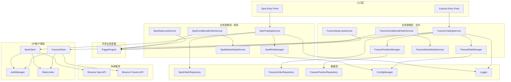

# 设计文档

## 概述

币安U本位合约交易系统是对现有现货交易系统的扩展，专门用于USDT保证金的永续合约和交割合约交易。系统采用模块化设计，最大程度复用现货系统的核心组件（如日志、配置、错误处理），同时为合约特有功能（杠杆管理、持仓管理、资金费率处理）提供独立模块。

系统将提供两个独立的命令行入口点：
- `binance-trader spot` - 现货交易
- `binance-trader futures` - 合约交易

两个系统可以独立运行，也可以同时运行以支持跨市场策略。所有合约API调用将使用币安合约API端点（`https://fapi.binance.com`），与现货API（`https://api.binance.com`）分离。

## 架构

系统采用分层架构，在现有三层架构基础上扩展合约交易功能：

### API客户端层
- **FuturesClient**: 封装所有币安合约API调用（新增）
- **SpotClient**: 现有的现货API客户端（重命名自BinanceClient）
- **AuthManager**: 认证和签名管理（共享）
- **RateLimiter**: 速率限制管理（共享，支持不同端点）

### 业务逻辑层
- **FuturesTradingService**: 合约交易逻辑（新增）
- **FuturesPositionManager**: 持仓管理（新增）
- **FuturesRiskManager**: 合约风险控制（新增）
- **FuturesMarketDataService**: 合约市场数据（新增）
- **FuturesConditionalOrderService**: 合约条件订单（新增）
- **FuturesStopLossService**: 合约止损止盈（新增）
- **SpotTradingService**: 现货交易逻辑（现有）
- **TriggerEngine**: 触发条件评估（共享）

### 数据层
- **FuturesOrderRepository**: 合约订单持久化（新增）
- **FuturesPositionRepository**: 持仓数据持久化（新增）
- **SpotOrderRepository**: 现货订单持久化（现有）
- **ConfigManager**: 配置管理（共享，扩展支持合约配置）
- **Logger**: 日志记录（共享）

### 架构图



## 组件和接口

### 1. FuturesClient

合约API客户端，负责所有与币安合约交易所的通信。

```go
type FuturesClient interface {
    // 账户信息
    GetAccountInfo() (*FuturesAccountInfo, error)
    GetBalance() (*FuturesBalance, error)
    
    // 市场数据
    GetMarkPrice(symbol string) (*MarkPrice, error)
    GetPrice(symbol string) (*Price, error)
    GetKlines(symbol string, interval string, limit int) ([]*Kline, error)
    GetFundingRate(symbol string) (*FundingRate, error)
    GetFundingRateHistory(symbol string, startTime, endTime int64) ([]*FundingRate, error)
    
    // 杠杆和保证金
    SetLeverage(symbol string, leverage int) error
    SetMarginType(symbol string, marginType MarginType) error
    SetPositionMode(dualSidePosition bool) error
    GetPositionMode() (*PositionMode, error)
    
    // 订单操作
    CreateOrder(order *FuturesOrderRequest) (*FuturesOrderResponse, error)
    CancelOrder(symbol string, orderID int64) (*CancelResponse, error)
    GetOrder(symbol string, orderID int64) (*FuturesOrder, error)
    GetOpenOrders(symbol string) ([]*FuturesOrder, error)
    
    // 持仓查询
    GetPositions(symbol string) ([]*Position, error)
    GetAllPositions() ([]*Position, error)
    GetPositionRisk(symbol string) (*PositionRisk, error)
    
    // 收益历史
    GetIncomeHistory(symbol string, incomeType IncomeType, startTime, endTime int64) ([]*Income, error)
}
```

### 2. FuturesTradingService

合约交易服务，实现核心合约交易逻辑。

```go
type FuturesTradingService interface {
    // 开仓
    OpenLongPosition(symbol string, quantity float64, orderType OrderType, price float64) (*FuturesOrder, error)
    OpenShortPosition(symbol string, quantity float64, orderType OrderType, price float64) (*FuturesOrder, error)
    
    // 平仓
    ClosePosition(symbol string, positionSide PositionSide, quantity float64) (*FuturesOrder, error)
    CloseAllPositions(symbol string) ([]*FuturesOrder, error)
    
    // 订单管理
    CancelOrder(orderID int64) error
    GetOrderStatus(orderID int64) (*FuturesOrderStatus, error)
    GetActiveOrders(symbol string) ([]*FuturesOrder, error)
    
    // 杠杆管理
    SetLeverage(symbol string, leverage int) error
    GetLeverage(symbol string) (int, error)
}
```

### 3. FuturesPositionManager

持仓管理器，管理和监控合约持仓。

```go
type FuturesPositionManager interface {
    // 持仓查询
    GetPosition(symbol string, positionSide PositionSide) (*Position, error)
    GetAllPositions() ([]*Position, error)
    
    // 持仓计算
    CalculateUnrealizedPnL(position *Position, markPrice float64) (float64, error)
    CalculateLiquidationPrice(position *Position) (float64, error)
    CalculateMarginRatio(position *Position) (float64, error)
    
    // 持仓更新
    UpdatePosition(symbol string) error
    UpdateAllPositions() error
    
    // 持仓历史
    GetPositionHistory(symbol string, startTime, endTime int64) ([]*ClosedPosition, error)
}
```

### 4. FuturesRiskManager

合约风险管理器，执行合约特定的风险控制规则。

```go
type FuturesRiskManager interface {
    // 风险检查
    ValidateOrder(order *FuturesOrderRequest) error
    CheckLiquidationRisk(position *Position, markPrice float64) (bool, error)
    CheckMarginSufficiency(symbol string, quantity float64, leverage int) error
    CheckMaxPositionSize(symbol string, quantity float64) error
    
    // 风险监控
    MonitorPositions() error
    GetRiskMetrics() (*RiskMetrics, error)
    
    // 限制管理
    UpdateLimits(limits *FuturesRiskLimits) error
    GetCurrentLimits() *FuturesRiskLimits
}
```

### 5. FuturesMarketDataService

合约市场数据服务，提供合约市场信息。

```go
type FuturesMarketDataService interface {
    GetMarkPrice(symbol string) (float64, error)
    GetLastPrice(symbol string) (float64, error)
    GetHistoricalData(symbol string, interval string, limit int) ([]*Kline, error)
    GetFundingRate(symbol string) (*FundingRate, error)
    SubscribeToMarkPrice(symbol string, callback func(float64)) error
    GetOpenInterest(symbol string) (float64, error)
}
```

### 6. FuturesConditionalOrderService

合约条件订单服务，管理合约条件触发订单。

```go
type FuturesConditionalOrderService interface {
    // 创建条件订单
    CreateConditionalOrder(order *FuturesConditionalOrderRequest) (*FuturesConditionalOrder, error)
    
    // 管理条件订单
    CancelConditionalOrder(orderID string) error
    UpdateConditionalOrder(orderID string, updates *FuturesConditionalOrderUpdate) error
    GetConditionalOrder(orderID string) (*FuturesConditionalOrder, error)
    GetActiveConditionalOrders() ([]*FuturesConditionalOrder, error)
    
    // 监控和触发
    StartMonitoring() error
    StopMonitoring() error
}
```

### 7. FuturesStopLossService

合约止损止盈服务，管理合约风险控制订单。

```go
type FuturesStopLossService interface {
    // 设置止损止盈
    SetStopLoss(symbol string, positionSide PositionSide, quantity float64, stopPrice float64) (*FuturesStopOrder, error)
    SetTakeProfit(symbol string, positionSide PositionSide, quantity float64, targetPrice float64) (*FuturesStopOrder, error)
    SetStopLossTakeProfit(symbol string, positionSide PositionSide, quantity float64, stopPrice, targetPrice float64) (*FuturesStopOrderPair, error)
    SetTrailingStop(symbol string, positionSide PositionSide, quantity float64, callbackRate float64) (*FuturesTrailingStopOrder, error)
    
    // 管理止损止盈订单
    CancelStopOrder(orderID string) error
    GetActiveStopOrders(symbol string) ([]*FuturesStopOrder, error)
    UpdateTrailingStop(orderID string, newCallbackRate float64) error
}
```

## 数据模型

### FuturesOrderRequest
```go
type FuturesOrderRequest struct {
    Symbol           string           // 合约交易对，如 "BTCUSDT"
    Side             OrderSide        // BUY 或 SELL
    PositionSide     PositionSide     // LONG, SHORT, 或 BOTH（单向持仓模式）
    Type             OrderType        // MARKET, LIMIT, STOP, TAKE_PROFIT
    Quantity         float64          // 交易数量
    Price            float64          // 价格（限价单）
    StopPrice        float64          // 触发价格（止损/止盈单）
    TimeInForce      string           // GTC, IOC, FOK, GTX
    ReduceOnly       bool             // 只减仓
    ClosePosition    bool             // 平仓标志
}
```

### FuturesOrder
```go
type FuturesOrder struct {
    OrderID          int64
    Symbol           string
    Side             OrderSide
    PositionSide     PositionSide
    Type             OrderType
    Status           OrderStatus
    Price            float64
    StopPrice        float64
    OrigQty          float64
    ExecutedQty      float64
    AvgPrice         float64
    ReduceOnly       bool
    ClosePosition    bool
    Time             int64
    UpdateTime       int64
}
```

### Position
```go
type Position struct {
    Symbol              string
    PositionSide        PositionSide      // LONG 或 SHORT
    PositionAmt         float64           // 持仓数量（正数表示多头，负数表示空头）
    EntryPrice          float64           // 开仓均价
    MarkPrice           float64           // 标记价格
    UnrealizedProfit    float64           // 未实现盈亏
    LiquidationPrice    float64           // 强平价格
    Leverage            int               // 杠杆倍数
    MarginType          MarginType        // ISOLATED 或 CROSSED
    IsolatedMargin      float64           // 逐仓保证金
    IsAutoAddMargin     bool              // 是否自动追加保证金
    PositionInitialMargin float64         // 持仓初始保证金
    MaintenanceMargin   float64           // 维持保证金
    UpdateTime          int64
}

type PositionSide string
const (
    PositionSideLong  PositionSide = "LONG"
    PositionSideShort PositionSide = "SHORT"
    PositionSideBoth  PositionSide = "BOTH"  // 单向持仓模式
)

type MarginType string
const (
    MarginTypeIsolated MarginType = "ISOLATED"  // 逐仓
    MarginTypeCrossed  MarginType = "CROSSED"   // 全仓
)
```

### ClosedPosition
```go
type ClosedPosition struct {
    Symbol           string
    PositionSide     PositionSide
    EntryPrice       float64
    ExitPrice        float64
    Quantity         float64
    RealizedProfit   float64
    OpenTime         int64
    CloseTime        int64
    Commission       float64
}
```

### FuturesBalance
```go
type FuturesBalance struct {
    Asset                  string   // "USDT"
    Balance                float64  // 总余额
    AvailableBalance       float64  // 可用余额
    CrossWalletBalance     float64  // 全仓钱包余额
    CrossUnPnl             float64  // 全仓未实现盈亏
    MaxWithdrawAmount      float64  // 最大可转出余额
    MarginAvailable        bool     // 是否可用作保证金
    UpdateTime             int64
}
```

### MarkPrice
```go
type MarkPrice struct {
    Symbol          string
    MarkPrice       float64
    IndexPrice      float64
    LastFundingRate float64
    NextFundingTime int64
    Time            int64
}
```

### FundingRate
```go
type FundingRate struct {
    Symbol       string
    FundingRate  float64
    FundingTime  int64
}
```

### Income
```go
type Income struct {
    Symbol     string
    IncomeType IncomeType
    Income     float64
    Asset      string
    Info       string
    Time       int64
    TranID     int64
}

type IncomeType string
const (
    IncomeTypeTransfer        IncomeType = "TRANSFER"
    IncomeTypeWelcomeBonus    IncomeType = "WELCOME_BONUS"
    IncomeTypeRealizedPnL     IncomeType = "REALIZED_PNL"
    IncomeTypeFundingFee      IncomeType = "FUNDING_FEE"
    IncomeTypeCommission      IncomeType = "COMMISSION"
    IncomeTypeInsuranceClear  IncomeType = "INSURANCE_CLEAR"
)
```

### PositionRisk
```go
type PositionRisk struct {
    Symbol           string
    PositionAmt      float64
    EntryPrice       float64
    MarkPrice        float64
    UnrealizedProfit float64
    LiquidationPrice float64
    Leverage         int
    MarginType       MarginType
    IsolatedMargin   float64
    PositionSide     PositionSide
    MarginRatio      float64  // 保证金率
}
```

### FuturesRiskLimits
```go
type FuturesRiskLimits struct {
    MaxOrderValue         float64  // 单笔最大订单价值
    MaxPositionValue      float64  // 最大持仓价值
    MaxLeverage           int      // 最大杠杆倍数
    MinMarginRatio        float64  // 最小保证金率（低于此值发出警告）
    LiquidationBuffer     float64  // 强平缓冲区（当前价格与强平价格的最小距离百分比）
    MaxDailyOrders        int      // 每日最大订单数
    MaxAPICallsPerMin     int      // 每分钟最大API调用数
}
```

### FuturesConditionalOrderRequest
```go
type FuturesConditionalOrderRequest struct {
    Symbol           string
    Side             OrderSide
    PositionSide     PositionSide
    Type             OrderType
    Quantity         float64
    Price            float64
    TriggerCondition *FuturesTriggerCondition
    ReduceOnly       bool
    TimeWindow       *TimeWindow
}
```

### FuturesTriggerCondition
```go
type FuturesTriggerCondition struct {
    Type            FuturesTriggerType
    Operator        ComparisonOperator
    Value           float64
    PriceType       PriceType              // MARK_PRICE 或 LAST_PRICE
    BasePrice       float64
    TimeWindow      time.Duration
    CompositeType   LogicOperator
    SubConditions   []*FuturesTriggerCondition
}

type FuturesTriggerType int
const (
    FuturesTriggerTypeMarkPrice FuturesTriggerType = iota
    FuturesTriggerTypeLastPrice
    FuturesTriggerTypeUnrealizedPnL
    FuturesTriggerTypeFundingRate
    FuturesTriggerTypeMarginRatio
)

type PriceType string
const (
    PriceTypeMark PriceType = "MARK"
    PriceTypeLast PriceType = "LAST"
)
```

### FuturesStopOrder
```go
type FuturesStopOrder struct {
    OrderID       string
    Symbol        string
    PositionSide  PositionSide
    Quantity      float64
    StopPrice     float64
    PriceType     PriceType
    Type          StopOrderType
    Status        StopOrderStatus
    CreatedAt     int64
    TriggeredAt   int64
    ExecutedOrderID int64
}
```

### FuturesTrailingStopOrder
```go
type FuturesTrailingStopOrder struct {
    OrderID          string
    Symbol           string
    PositionSide     PositionSide
    Quantity         float64
    CallbackRate     float64  // 回调幅度百分比
    ActivationPrice  float64  // 激活价格
    CurrentStopPrice float64  // 当前止损价格
    Status           StopOrderStatus
    CreatedAt        int64
    LastUpdatedAt    int64
}
```

### RiskMetrics
```go
type RiskMetrics struct {
    TotalPositionValue    float64
    TotalUnrealizedPnL    float64
    TotalMarginUsed       float64
    AvailableMargin       float64
    MarginRatio           float64
    PositionsAtRisk       int      // 接近强平的持仓数量
    LeverageUtilization   float64  // 杠杆使用率
}
```

### Config扩展
```go
// 在现有Config结构中添加
type Config struct {
    // ... 现有现货配置 ...
    
    Futures FuturesConfig `yaml:"futures"`
}

type FuturesConfig struct {
    APIKey              string              `yaml:"api_key"`
    APISecret           string              `yaml:"api_secret"`
    BaseURL             string              `yaml:"base_url"`
    Testnet             bool                `yaml:"testnet"`
    DefaultLeverage     int                 `yaml:"default_leverage"`
    DefaultMarginType   MarginType          `yaml:"default_margin_type"`
    DualSidePosition    bool                `yaml:"dual_side_position"`
    Risk                FuturesRiskLimits   `yaml:"risk"`
    MonitoringInterval  int                 `yaml:"monitoring_interval_ms"`
}
```


## 正确性属性

*属性是指在系统所有有效执行中都应该成立的特征或行为——本质上是关于系统应该做什么的形式化陈述。属性是人类可读规范和机器可验证正确性保证之间的桥梁。*

### 属性 1: 合约API凭证验证
*对于任何* API凭证，验证函数必须正确识别有效和无效凭证
**验证: 需求 1.1, 1.2**

### 属性 2: HTTPS协议强制使用
*对于任何* 合约API请求URL，该URL必须以"https://fapi.binance.com"开头
**验证: 需求 1.3**

### 属性 3: 请求签名正确性
*对于任何* 合约API请求参数，使用HMAC SHA256算法生成的签名必须可以通过相同参数和密钥验证
**验证: 需求 1.4**

### 属性 4: 价格数据结构完整性
*对于任何* 合约的价格查询响应，返回的数据必须包含标记价格和最新成交价字段
**验证: 需求 2.1**

### 属性 5: K线数据范围一致性
*对于任何* K线数据请求，返回的K线数量不应超过请求的限制，且所有K线的时间戳应在请求的时间范围内
**验证: 需求 2.2**

### 属性 6: 合约余额数据完整性
*对于任何* 账户余额查询响应，返回的数据必须包含USDT余额和可用保证金字段
**验证: 需求 2.3**

### 属性 7: 资金费率数据完整性
*对于任何* 资金费率查询响应，返回的数据必须包含当前资金费率和下次结算时间字段
**验证: 需求 2.4**

### 属性 8: 重试机制正确性
*对于任何* 失败的合约API请求，系统应该最多重试3次，且每次重试的间隔应该递增
**验证: 需求 2.5**

### 属性 9: 杠杆值范围验证
*对于任何* 杠杆设置请求，如果杠杆值不在1到125之间，验证函数必须返回错误
**验证: 需求 3.1**

### 属性 10: 保证金模式切换条件
*对于任何* 保证金模式切换请求，当存在持仓时必须被拒绝，无持仓时必须被允许
**验证: 需求 3.2, 3.5**

### 属性 11: 仓位模式切换条件
*对于任何* 仓位模式切换请求，当存在持仓时必须被拒绝，无持仓时必须被允许
**验证: 需求 3.3, 3.5**

### 属性 12: 杠杆设置响应完整性
*对于任何* 成功的杠杆设置响应，响应必须包含确认信息和当前杠杆配置
**验证: 需求 3.4**

### 属性 13: 市价开多单参数正确性
*对于任何* 市价开多单请求，订单类型必须为MARKET，方向必须为BUY，持仓方向必须为LONG
**验证: 需求 4.1**

### 属性 14: 限价开空单参数完整性
*对于任何* 限价开空单请求，订单必须包含价格字段，类型为LIMIT，方向为SELL，持仓方向为SHORT
**验证: 需求 4.2**

### 属性 15: 平仓方向正确性
*对于任何* 持仓和平仓订单，平仓订单的方向必须与持仓方向相反
**验证: 需求 4.3**

### 属性 16: 合约订单响应完整性
*对于任何* 成功的订单创建响应，响应必须包含订单ID、状态、执行价格和持仓信息字段
**验证: 需求 4.4**

### 属性 17: 保证金充足性检查
*对于任何* 订单请求，如果所需保证金超过可用保证金，订单必须被拒绝
**验证: 需求 4.5**

### 属性 18: 持仓查询响应完整性
*对于任何* 持仓查询响应，每个持仓必须包含数量、开仓价格、标记价格、未实现盈亏和强平价格字段
**验证: 需求 5.1**

### 属性 19: 持仓历史时间过滤
*对于任何* 持仓历史查询，返回的所有记录的平仓时间必须在指定的时间范围内
**验证: 需求 5.2**

### 属性 20: 特定合约持仓过滤
*对于任何* 特定合约的持仓查询，返回的所有持仓的交易对必须匹配查询的合约
**验证: 需求 5.3**

### 属性 21: 持仓盈亏计算正确性
*对于任何* 持仓和标记价格更新，未实现盈亏必须等于 (标记价格 - 开仓价格) * 持仓数量，强平价格必须根据保证金和维持保证金率重新计算
**验证: 需求 5.4**

### 属性 22: 双向持仓分离显示
*对于任何* 双向持仓模式下的持仓查询，多头和空头持仓必须分别返回
**验证: 需求 5.5**

### 属性 23: 强平风险警告
*对于任何* 持仓，当强平价格与当前标记价格的距离小于配置的缓冲区百分比时，必须触发风险警告
**验证: 需求 6.1**

### 属性 24: 保证金率警告
*对于任何* 账户状态，当保证金率低于维持保证金率时，必须触发强平警告
**验证: 需求 6.2**

### 属性 25: 订单价值限制
*对于任何* 订单请求，如果订单价值超过配置的最大限额，订单必须被拒绝
**验证: 需求 6.3**

### 属性 26: 持仓总量限制
*对于任何* 开仓请求，如果执行后总持仓价值超过配置的最大风险敞口，订单必须被拒绝
**验证: 需求 6.4**

### 属性 27: 异常资金费率日志
*对于任何* 资金费率，当其绝对值超过配置的异常阈值时，日志必须包含警告信息
**验证: 需求 6.5**

### 属性 28: 多头止损触发正确性
*对于任何* 多头持仓和止损价格，当标记价格序列中出现价格跌破止损价格时，系统必须识别该触发点
**验证: 需求 7.1**

### 属性 29: 空头止损触发正确性
*对于任何* 空头持仓和止损价格，当标记价格序列中出现价格突破止损价格时，系统必须识别该触发点
**验证: 需求 7.2**

### 属性 30: 止盈触发正确性
*对于任何* 持仓和止盈价格，当标记价格达到或超过止盈价格时，系统必须识别该触发点
**验证: 需求 7.3**

### 属性 31: 止损止盈互斥性
*对于任何* 止损止盈配对订单，当其中一个订单被触发后，另一个订单的状态必须变为已取消
**验证: 需求 7.4**

### 属性 32: 移动止损价格调整
*对于任何* 移动止损订单和价格序列，当价格向有利方向移动时，止损价格必须按照设定的回调幅度跟随调整
**验证: 需求 7.5**

### 属性 33: 标记价格触发监控
*对于任何* 价格触发订单和标记价格序列，当价格满足触发条件时，系统必须识别该触发点
**验证: 需求 8.1, 8.2**

### 属性 34: 盈亏触发监控
*对于任何* 基于盈亏的触发订单和盈亏序列，当未实现盈亏达到阈值时，系统必须识别该触发点
**验证: 需求 8.3**

### 属性 35: 资金费率触发监控
*对于任何* 基于资金费率的触发订单和费率序列，当资金费率达到阈值时，系统必须识别该触发点
**验证: 需求 8.4**

### 属性 36: 触发事件日志完整性
*对于任何* 触发的条件订单，日志必须包含触发时间、触发值和订单ID
**验证: 需求 8.5**

### 属性 37: 合约API操作日志完整性
*对于任何* 合约API操作，日志条目必须包含操作类型、时间戳和结果状态
**验证: 需求 9.1**

### 属性 38: 订单事件日志完整性
*对于任何* 订单创建、执行或取消事件，日志必须包含完整的订单详情和持仓变化信息
**验证: 需求 9.2**

### 属性 39: 强平事件日志完整性
*对于任何* 强平事件，日志必须包含强平原因、强平价格和损失金额
**验证: 需求 9.3**

### 属性 40: 资金费率结算日志完整性
*对于任何* 资金费率结算事件，日志必须包含支付或收取的资金费用金额
**验证: 需求 9.4**

### 属性 41: 敏感信息屏蔽
*对于任何* 包含API密钥或密钥的日志条目，敏感信息必须被屏蔽（例如只显示前4位和后4位）
**验证: 需求 9.5**

### 属性 42: 合约配置加载正确性
*对于任何* 包含合约配置段的配置文件，合约特定参数必须被正确解析和加载
**验证: 需求 10.3**

### 属性 43: 日志交易类型标记
*对于任何* 合约交易日志条目，日志必须包含明确的交易类型标记（如"FUTURES"）
**验证: 需求 10.4, 11.5**

### 属性 44: 配置段独立加载
*对于任何* 共享配置文件，现货和合约系统必须能够独立加载各自的配置段而不互相干扰
**验证: 需求 11.4**

### 属性 45: 资金费率结算触发
*对于任何* 资金费率结算时间，当时间到达时，系统必须自动触发资金费用查询
**验证: 需求 12.1**

### 属性 46: 多头资金费用计算
*对于任何* 多头持仓和正资金费率，结算的资金费用必须为负值（表示支付）
**验证: 需求 12.2**

### 属性 47: 空头资金费用计算
*对于任何* 空头持仓和正资金费率，结算的资金费用必须为正值（表示收取）
**验证: 需求 12.3**

### 属性 48: 资金费用结算后状态更新
*对于任何* 资金费用结算，结算后账户余额和持仓成本必须根据费用金额进行相应调整
**验证: 需求 12.4**

### 属性 49: 资金费率历史时间过滤
*对于任何* 资金费率历史查询，返回的所有记录的结算时间必须在指定的时间范围内
**验证: 需求 12.5**

## 错误处理

### 合约API错误处理
- **网络错误**: 实现指数退避重试机制，最多重试3次
- **认证错误**: 立即返回错误，不进行重试，记录详细日志
- **速率限制错误**: 自动延迟后续请求，等待速率限制窗口重置
- **业务错误**: 解析错误代码和消息，返回用户友好的错误信息
- **强平错误**: 记录强平详情，通知用户并停止相关交易

### 合约特定错误类型
```go
type FuturesErrorType int

const (
    // 继承现货错误类型
    ErrNetwork FuturesErrorType = iota
    ErrAuthentication
    ErrRateLimit
    ErrInvalidParameter
    
    // 合约特定错误
    ErrInsufficientMargin
    ErrInvalidLeverage
    ErrPositionModeConflict
    ErrMarginModeConflict
    ErrLiquidationRisk
    ErrMaxPositionExceeded
    ErrReduceOnlyViolation
    ErrPositionNotFound
)

type FuturesTradingError struct {
    Type    FuturesErrorType
    Message string
    Code    int
    Cause   error
}
```

### 重试策略
- 第1次重试: 延迟1秒
- 第2次重试: 延迟2秒
- 第3次重试: 延迟4秒
- 超过3次后返回最终错误

### 错误恢复
- 订单创建失败: 回滚本地状态，释放预留保证金
- 订单取消失败: 标记订单为"取消待确认"，稍后重试
- 持仓同步失败: 使用缓存数据，后台继续尝试同步
- 条件订单触发失败: 记录失败原因，保留条件订单以便重试
- 止损止盈执行失败: 立即重试最多3次，记录所有尝试
- 强平通知失败: 持续尝试通知，记录强平详情
- 资金费率查询失败: 使用缓存的费率数据，后台继续尝试

## 测试策略

### 单元测试
使用Go标准库的`testing`包进行单元测试：

- **合约API客户端测试**: 使用httptest模拟币安合约API响应
- **合约交易逻辑测试**: 测试开仓、平仓、杠杆设置等逻辑
- **持仓管理测试**: 测试持仓计算、盈亏计算、强平价格计算
- **合约风险管理测试**: 测试各种合约风险控制规则
- **资金费率处理测试**: 测试资金费率查询和结算逻辑
- **条件订单服务测试**: 测试合约条件订单的创建、更新和触发
- **止损止盈服务测试**: 测试合约止损止盈订单的设置和触发
- **配置加载测试**: 测试合约配置的独立加载和解析
- **入口点测试**: 测试现货和合约入口的独立初始化

### 属性测试
使用`gopter`库（Go的属性测试框架）进行属性测试：

- 每个属性测试应该运行至少100次迭代
- 每个属性测试必须使用注释标记对应的设计文档属性
- 标记格式: `// Feature: usdt-futures-trading, Property X: [属性描述]`
- 使用生成器创建随机测试数据（订单、持仓、价格、杠杆等）
- 验证系统在各种输入下的正确性属性
- 特别关注边界条件：最大杠杆、接近强平、极端资金费率等

### 集成测试
- 使用币安合约测试网进行集成测试
- 测试完整的合约交易流程：连接 -> 设置杠杆 -> 开仓 -> 查询持仓 -> 平仓
- 测试条件订单流程：创建条件订单 -> 监控触发 -> 执行订单 -> 验证持仓
- 测试止损止盈流程：设置止损止盈 -> 模拟价格变动 -> 验证触发和平仓
- 测试资金费率流程：持有持仓 -> 等待结算 -> 验证费用扣除
- 测试双入口运行：同时启动现货和合约系统，验证独立运行
- 验证错误处理和重试机制

### 测试覆盖率目标
- 单元测试覆盖率: 80%以上
- 核心业务逻辑覆盖率: 90%以上
- 所有正确性属性必须有对应的属性测试

## 安全考虑

### API密钥管理
- 使用环境变量存储合约API密钥和密钥
- 永远不要在代码中硬编码凭证
- 在日志中屏蔽所有敏感信息
- 合约和现货可以使用相同或不同的API密钥

### 请求签名
- 所有私有合约API请求必须使用HMAC SHA256签名
- 包含时间戳防止重放攻击
- 验证响应的完整性

### 速率限制
- 遵守币安合约API速率限制（每分钟2400个请求）
- 实现本地速率限制器防止超限
- 监控API权重使用情况
- 合约和现货使用独立的速率限制器

### 风险控制
- 强制执行杠杆限制（1-125x）
- 监控强平风险，及时警告
- 限制单笔订单和总持仓规模
- 记录所有高风险操作

## 性能考虑

### 并发处理
- 使用goroutine处理并发合约API请求
- 使用channel进行goroutine间通信
- 实现连接池管理HTTP连接
- 持仓监控和条件订单监控使用独立goroutine

### 缓存策略
- 缓存标记价格（缓存1秒）
- 缓存资金费率（缓存1分钟）
- 缓存持仓信息（缓存5秒）
- 使用内存缓存提高响应速度
- 条件订单监控使用共享缓存避免重复API调用

### 资源管理
- 及时关闭HTTP连接
- 限制并发goroutine数量
- 实现优雅关闭机制
- 定期清理过期的缓存数据

## 配置管理

### 配置文件格式扩展
在现有YAML配置基础上添加合约配置段：

```yaml
# 现有现货配置
spot:
  api_key: ${BINANCE_SPOT_API_KEY}
  api_secret: ${BINANCE_SPOT_API_SECRET}
  base_url: https://api.binance.com
  testnet: false
  # ... 其他现货配置 ...

# 新增合约配置
futures:
  api_key: ${BINANCE_FUTURES_API_KEY}
  api_secret: ${BINANCE_FUTURES_API_SECRET}
  base_url: https://fapi.binance.com
  testnet: false
  
  # 合约特定配置
  default_leverage: 10
  default_margin_type: CROSSED
  dual_side_position: false
  
  risk:
    max_order_value: 50000.0
    max_position_value: 100000.0
    max_leverage: 20
    min_margin_ratio: 0.05
    liquidation_buffer: 0.02
    max_daily_orders: 200
    max_api_calls_per_min: 2000
  
  monitoring:
    position_update_interval_ms: 5000
    conditional_order_interval_ms: 1000
    funding_rate_check_interval_ms: 60000
  
  stop_loss:
    default_callback_rate: 1.0
    min_callback_rate: 0.1
    max_callback_rate: 5.0

# 共享配置
logging:
  level: info
  spot_file: logs/spot_trading.log
  futures_file: logs/futures_trading.log
  max_size_mb: 100
  max_backups: 5

retry:
  max_attempts: 3
  initial_delay_ms: 1000
  backoff_multiplier: 2.0
```

### 环境变量
- `BINANCE_SPOT_API_KEY`: 现货API密钥
- `BINANCE_SPOT_API_SECRET`: 现货API密钥
- `BINANCE_FUTURES_API_KEY`: 合约API密钥（可与现货相同）
- `BINANCE_FUTURES_API_SECRET`: 合约API密钥（可与现货相同）
- `CONFIG_FILE`: 配置文件路径（默认: config.yaml）
- `LOG_LEVEL`: 日志级别（默认: info）

## 部署考虑

### 依赖项
- Go 1.21或更高版本
- 外部库:
  - `github.com/adshao/go-binance/v2`: 币安Go SDK（支持现货和合约）
  - `gopkg.in/yaml.v3`: YAML配置解析
  - `github.com/sirupsen/logrus`: 结构化日志
  - `github.com/leanovate/gopter`: 属性测试框架

### 构建和运行

```bash
# 构建
go build -o binance-trader cmd/main.go

# 运行现货交易
export BINANCE_SPOT_API_KEY=your_spot_api_key
export BINANCE_SPOT_API_SECRET=your_spot_api_secret
./binance-trader spot

# 运行合约交易
export BINANCE_FUTURES_API_KEY=your_futures_api_key
export BINANCE_FUTURES_API_SECRET=your_futures_api_secret
./binance-trader futures

# 同时运行（在不同终端）
./binance-trader spot &
./binance-trader futures &
```

### 入口点设计

主程序将支持子命令：

```go
// cmd/main.go
func main() {
    if len(os.Args) < 2 {
        fmt.Println("Usage: binance-trader [spot|futures]")
        os.Exit(1)
    }
    
    command := os.Args[1]
    switch command {
    case "spot":
        runSpotTrading()
    case "futures":
        runFuturesTrading()
    default:
        fmt.Printf("Unknown command: %s\n", command)
        os.Exit(1)
    }
}
```

### 监控和日志
- 使用结构化日志便于分析
- 记录所有交易操作和错误
- 实现健康检查端点
- 监控API调用成功率和延迟
- 分别记录现货和合约日志
- 监控持仓风险和强平警告
- 记录资金费率结算详情

## 代码复用策略

### 共享组件
以下组件将在现货和合约系统之间共享：

1. **AuthManager**: 认证和签名逻辑完全相同
2. **RateLimiter**: 扩展支持不同端点的独立限制
3. **Logger**: 统一日志接口，添加交易类型标记
4. **ConfigManager**: 扩展支持多配置段
5. **TriggerEngine**: 触发条件评估逻辑通用
6. **错误处理**: 基础错误类型和处理逻辑

### 独立组件
以下组件将为合约系统独立实现：

1. **FuturesClient**: 合约API端点和参数不同
2. **FuturesTradingService**: 合约交易逻辑（开仓、平仓、杠杆）
3. **FuturesPositionManager**: 持仓管理和计算
4. **FuturesRiskManager**: 合约特定风险规则
5. **FuturesMarketDataService**: 合约市场数据（标记价格、资金费率）
6. **FuturesOrderRepository**: 合约订单数据模型
7. **FuturesPositionRepository**: 持仓数据持久化

### 接口设计原则
- 定义通用接口（如`Client`, `TradingService`）
- 现货和合约分别实现这些接口
- 使用依赖注入支持不同实现
- 通过工厂模式根据交易类型创建相应组件

## 迁移和兼容性

### 现有代码重构
1. 将`BinanceClient`重命名为`SpotClient`
2. 将`TradingService`重命名为`SpotTradingService`
3. 提取共享接口和类型到`pkg/`目录
4. 更新配置结构支持多配置段
5. 更新日志添加交易类型标记

### 向后兼容性
- 保持现有现货交易功能不变
- 现有配置文件格式保持兼容
- 添加默认值支持旧配置
- 提供配置迁移工具

### 渐进式实现
1. 第一阶段: 重构现有代码，提取共享组件
2. 第二阶段: 实现合约API客户端和基础交易功能
3. 第三阶段: 实现持仓管理和风险控制
4. 第四阶段: 实现条件订单和止损止盈
5. 第五阶段: 实现资金费率处理和完整监控
